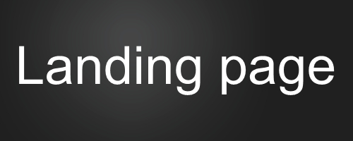
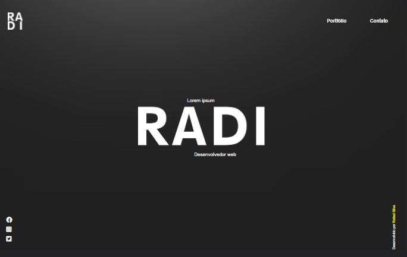
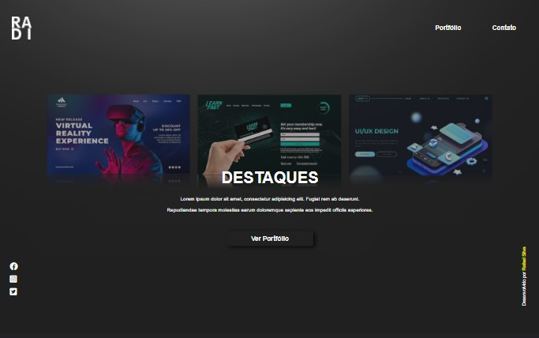
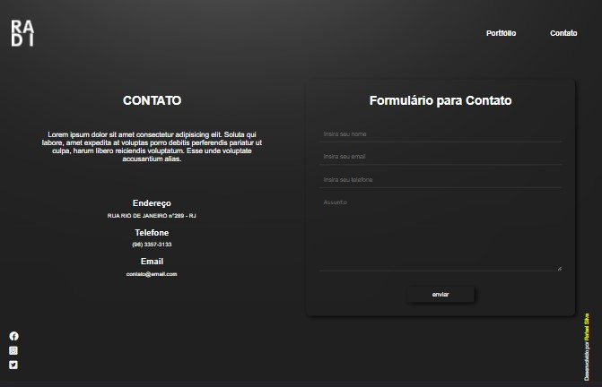
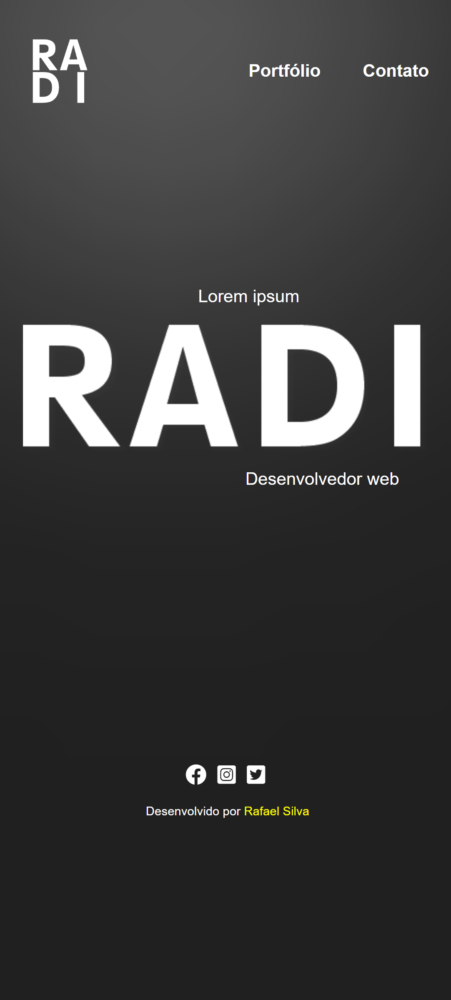
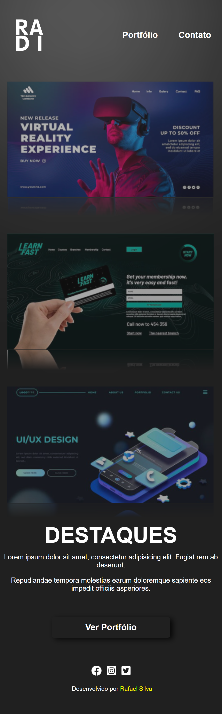
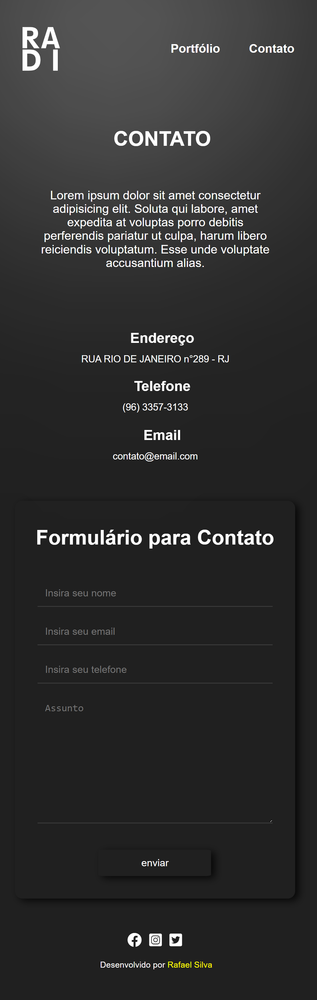

# Readme

<h1>
    
</h1> 

# 👀 Demonstração
## Modelos Desktops

 

## Modelos Mobile

 

# 💻 Sobre
O projeto landing page foi desenvolvido para praticar e aplicar conceitos de formatação com HTML5 e estilização com CSS3, tendo como base inspiradora a arte  postada na plataforma Pinterest Carregado por [Samuele Schiatti.](https://br.pinterest.com/pin/896638607035024218/) 

# 🚀 Tecnologias
- [HTML5](https://www.w3schools.com/html/)
- [CSS3](https://www.w3schools.com/css/)
 

# 📑 Descrição
A landing page é composta por três páginas, sendo elas:
- Index
    * página principal.
- Portfólio
    * página que apresenta projetos em destaques.
- Contato
    * página que possui uma pequena descrição, endereço, telefone e email além de um formulário. 
 

